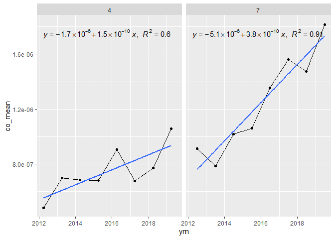
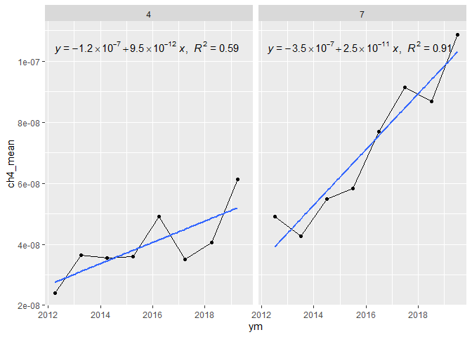
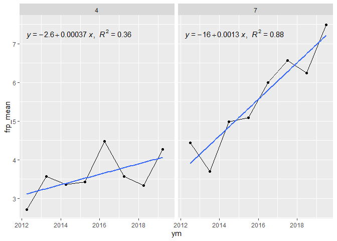
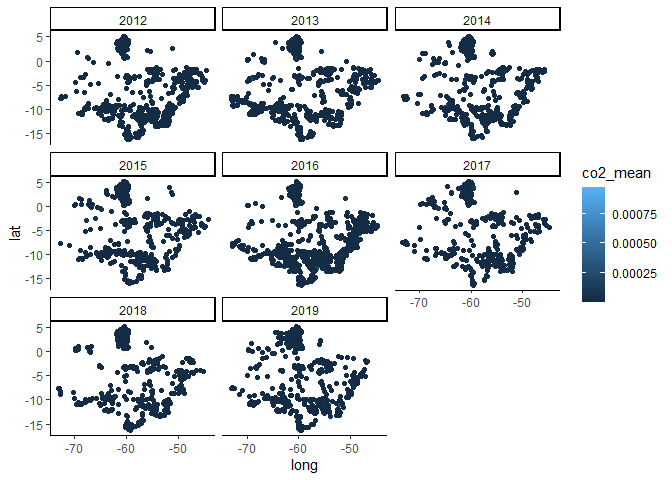

<!-- README.md is generated from README.Rmd. Please edit that file -->

# luciano-maria-dr

## Organizandos os dados, compilando, selecionando e criando datas

``` r
`%>%` <- magrittr::`%>%`

amazon_data <- rbind(readr::read_rds("data/df_1.rds"),
readr::read_rds("data/df_2.rds"),
readr::read_rds("data/df_3.rds")) %>%
  janitor::clean_names() %>%
  dplyr::mutate(year = as.numeric(substr(ymd, 1, 4)),
         month = as.numeric(substr(ymd, 5, 6)),
         day = as.numeric(substr(ymd, 7, 8)),
         date = lubridate::make_date(year,month,day)) %>%
  dplyr::select(-ymd, -flag_am) %>%
  dplyr::relocate(long,lat,date,year,month,day)
dplyr::glimpse(amazon_data)
#> Rows: 3,318,517
#> Columns: 10
#> $ long     <dbl> -64.4425, -60.5525, -60.5375, -60.5275, -60.5325, -60.7125, -~
#> $ lat      <dbl> 3.8575, 4.9125, 4.8325, 4.8275, 4.8225, 4.7325, 4.7125, 4.437~
#> $ date     <date> 2012-01-20, 2012-01-20, 2012-01-20, 2012-01-20, 2012-01-20, ~
#> $ year     <dbl> 2012, 2012, 2012, 2012, 2012, 2012, 2012, 2012, 2012, 2012, 2~
#> $ month    <dbl> 1, 1, 1, 1, 1, 1, 1, 1, 1, 1, 1, 1, 1, 1, 1, 1, 1, 1, 1, 1, 1~
#> $ day      <dbl> 20, 20, 20, 20, 20, 20, 20, 20, 20, 20, 20, 20, 20, 20, 20, 2~
#> $ ch4      <dbl> 1.074019e-07, 1.255490e-08, 7.695770e-09, 9.797025e-09, 9.360~
#> $ co       <dbl> 1.718430e-06, 3.208474e-07, 1.966697e-07, 2.503684e-07, 2.392~
#> $ co2      <dbl> 2.676785e-05, 7.718937e-06, 4.731473e-06, 6.023356e-06, 5.754~
#> $ frp_mean <dbl> 6.6500, 2.3000, 1.4100, 1.7950, 1.7150, 3.6200, 1.8350, 0.980~
```

## Mapas para teste

``` r
amazon_data %>% dplyr::filter(month %in% c(4,7)) %>% 
  dplyr::group_by(year,month) %>% 
  dplyr::summarise(co2_mean = mean(co2,na.rm=TRUE),
                   n=dplyr::n(),
                   co2_stderr = sd(co2,na.rm=TRUE)/(n)^.5) %>% 
  dplyr::mutate(ym = lubridate::make_date(year,month,day=1)
                ) %>% 
  ggplot2::ggplot(ggplot2::aes(ym,co2_mean)) +
  ggplot2::geom_point() +
  ggplot2::geom_line() +
  ggplot2::facet_wrap(~month)+
  ggplot2::geom_smooth(method = "lm",se=FALSE)+
  ggpubr::stat_regline_equation(ggplot2::aes(
  label =  paste(..eq.label.., ..rr.label.., sep = "*plain(\",\")~~")))
```

<!-- -->

``` r
lm(co2_mean~year, data = amazon_data %>% dplyr::filter(month==4) %>% 
  dplyr::group_by(year,month) %>% 
  dplyr::summarise(co2_mean = mean(co2,na.rm=TRUE))
) %>% summary.lm()
#> 
#> Call:
#> lm(formula = co2_mean ~ year, data = amazon_data %>% dplyr::filter(month == 
#>     4) %>% dplyr::group_by(year, month) %>% dplyr::summarise(co2_mean = mean(co2, 
#>     na.rm = TRUE)))
#> 
#> Residuals:
#>        Min         1Q     Median         3Q        Max 
#> -1.938e-06 -1.652e-06  8.560e-09  1.244e-06  2.730e-06 
#> 
#> Coefficients:
#>               Estimate Std. Error t value Pr(>|t|)  
#> (Intercept) -1.384e-03  5.769e-04  -2.399   0.0534 .
#> year         6.935e-07  2.862e-07   2.423   0.0517 .
#> ---
#> Signif. codes:  0 '***' 0.001 '**' 0.01 '*' 0.05 '.' 0.1 ' ' 1
#> 
#> Residual standard error: 1.855e-06 on 6 degrees of freedom
#> Multiple R-squared:  0.4945, Adjusted R-squared:  0.4103 
#> F-statistic:  5.87 on 1 and 6 DF,  p-value: 0.05166
```

``` r
lm(co2_mean~year, data = amazon_data %>% dplyr::filter(month==7) %>% 
  dplyr::group_by(year,month) %>% 
  dplyr::summarise(co2_mean = mean(co2,na.rm=TRUE))
) %>% summary.lm()
#> 
#> Call:
#> lm(formula = co2_mean ~ year, data = amazon_data %>% dplyr::filter(month == 
#>     7) %>% dplyr::group_by(year, month) %>% dplyr::summarise(co2_mean = mean(co2, 
#>     na.rm = TRUE)))
#> 
#> Residuals:
#>        Min         1Q     Median         3Q        Max 
#> -2.269e-06 -1.565e-06  3.814e-07  1.207e-06  2.225e-06 
#> 
#> Coefficients:
#>               Estimate Std. Error t value Pr(>|t|)    
#> (Intercept) -4.024e-03  5.789e-04  -6.951 0.000440 ***
#> year         2.007e-06  2.872e-07   6.989 0.000427 ***
#> ---
#> Signif. codes:  0 '***' 0.001 '**' 0.01 '*' 0.05 '.' 0.1 ' ' 1
#> 
#> Residual standard error: 1.861e-06 on 6 degrees of freedom
#> Multiple R-squared:  0.8906, Adjusted R-squared:  0.8724 
#> F-statistic: 48.84 on 1 and 6 DF,  p-value: 0.0004272
```

``` r
amazon_data %>% dplyr::filter(month %in% c(7,4)) %>% 
  dplyr::group_by(year,month) %>% 
  dplyr::summarise(co_mean = mean(co,na.rm=TRUE),
                   n=dplyr::n(),
                   co_stderr = sd(co,na.rm=TRUE)/(n)^.5) %>% 
  dplyr::mutate(ym = lubridate::make_date(year,month,day=1)
                ) %>% 
  ggplot2::ggplot(ggplot2::aes(ym,co_mean)) +
  ggplot2::geom_point() +
  ggplot2::geom_line() +
  ggplot2::facet_wrap(~month)+
  ggplot2::geom_smooth(method = "lm",se=FALSE) +
  ggpubr::stat_regline_equation(ggplot2::aes(
  label =  paste(..eq.label.., ..rr.label.., sep = "*plain(\",\")~~")))
```

<!-- -->

``` r
lm(co_mean~year, data = amazon_data %>% dplyr::filter(month==4) %>% 
  dplyr::group_by(year,month) %>% 
  dplyr::summarise(co_mean = mean(co,na.rm=TRUE))
) %>% summary.lm()
#> 
#> Call:
#> lm(formula = co_mean ~ year, data = amazon_data %>% dplyr::filter(month == 
#>     4) %>% dplyr::group_by(year, month) %>% dplyr::summarise(co_mean = mean(co, 
#>     na.rm = TRUE)))
#> 
#> Residuals:
#>        Min         1Q     Median         3Q        Max 
#> -1.494e-07 -8.034e-08 -7.612e-09  9.712e-08  1.351e-07 
#> 
#> Coefficients:
#>               Estimate Std. Error t value Pr(>|t|)  
#> (Intercept) -1.091e-04  3.640e-05  -2.998   0.0241 *
#> year         5.451e-08  1.806e-08   3.018   0.0234 *
#> ---
#> Signif. codes:  0 '***' 0.001 '**' 0.01 '*' 0.05 '.' 0.1 ' ' 1
#> 
#> Residual standard error: 1.17e-07 on 6 degrees of freedom
#> Multiple R-squared:  0.6029, Adjusted R-squared:  0.5368 
#> F-statistic: 9.111 on 1 and 6 DF,  p-value: 0.02344
```

``` r
lm(co_mean~year, data = amazon_data %>% dplyr::filter(month==7) %>% 
  dplyr::group_by(year,month) %>% 
  dplyr::summarise(co_mean = mean(co,na.rm=TRUE))
) %>% summary.lm()
#> 
#> Call:
#> lm(formula = co_mean ~ year, data = amazon_data %>% dplyr::filter(month == 
#>     7) %>% dplyr::group_by(year, month) %>% dplyr::summarise(co_mean = mean(co, 
#>     na.rm = TRUE)))
#> 
#> Residuals:
#>        Min         1Q     Median         3Q        Max 
#> -1.220e-07 -1.142e-07  7.469e-09  8.705e-08  1.507e-07 
#> 
#> Coefficients:
#>               Estimate Std. Error t value Pr(>|t|)    
#> (Intercept) -2.789e-04  3.673e-05  -7.592 0.000272 ***
#> year         1.390e-07  1.823e-08   7.626 0.000265 ***
#> ---
#> Signif. codes:  0 '***' 0.001 '**' 0.01 '*' 0.05 '.' 0.1 ' ' 1
#> 
#> Residual standard error: 1.181e-07 on 6 degrees of freedom
#> Multiple R-squared:  0.9065, Adjusted R-squared:  0.8909 
#> F-statistic: 58.15 on 1 and 6 DF,  p-value: 0.0002652
```

``` r
amazon_data %>% dplyr::filter(month %in% c(4,7)) %>% 
  dplyr::group_by(year,month) %>% 
  dplyr::summarise(ch4_mean = mean(ch4,na.rm=TRUE),
                   n=dplyr::n(),
                   ch4_stderr = sd(ch4,na.rm=TRUE)/(n)^.5) %>% 
  dplyr::mutate(ym = lubridate::make_date(year,month,day=1)
                ) %>% 
  ggplot2::ggplot(ggplot2::aes(ym,ch4_mean)) +
  ggplot2::geom_point() +
  ggplot2::geom_line() +
  ggplot2::geom_smooth(method = "lm",se=FALSE)+
  ggplot2::facet_wrap(~month)+
  ggpubr::stat_regline_equation(ggplot2::aes(
  label =  paste(..eq.label.., ..rr.label.., sep = "*plain(\",\")~~")))
```

<!-- -->

``` r
lm(ch4_mean~year, data = amazon_data %>% dplyr::filter(month==4) %>% 
  dplyr::group_by(year,month) %>% 
  dplyr::summarise(ch4_mean = mean(ch4,na.rm=TRUE))
) %>% summary.lm()
#> 
#> Call:
#> lm(formula = ch4_mean ~ year, data = amazon_data %>% dplyr::filter(month == 
#>     4) %>% dplyr::group_by(year, month) %>% dplyr::summarise(ch4_mean = mean(ch4, 
#>     na.rm = TRUE)))
#> 
#> Residuals:
#>        Min         1Q     Median         3Q        Max 
#> -9.961e-09 -4.580e-09 -5.423e-10  5.972e-09  9.389e-09 
#> 
#> Coefficients:
#>               Estimate Std. Error t value Pr(>|t|)  
#> (Intercept) -6.979e-06  2.395e-06  -2.914   0.0268 *
#> year         3.482e-09  1.188e-09   2.931   0.0263 *
#> ---
#> Signif. codes:  0 '***' 0.001 '**' 0.01 '*' 0.05 '.' 0.1 ' ' 1
#> 
#> Residual standard error: 7.7e-09 on 6 degrees of freedom
#> Multiple R-squared:  0.5888, Adjusted R-squared:  0.5203 
#> F-statistic: 8.591 on 1 and 6 DF,  p-value: 0.02625
```

``` r
lm(ch4_mean~year, data = amazon_data %>% dplyr::filter(month==7) %>% 
  dplyr::group_by(year,month) %>% 
  dplyr::summarise(ch4_mean = mean(ch4,na.rm=TRUE))
) %>% summary.lm()
#> 
#> Call:
#> lm(formula = ch4_mean ~ year, data = amazon_data %>% dplyr::filter(month == 
#>     7) %>% dplyr::group_by(year, month) %>% dplyr::summarise(ch4_mean = mean(ch4, 
#>     na.rm = TRUE)))
#> 
#> Residuals:
#>        Min         1Q     Median         3Q        Max 
#> -8.349e-09 -5.988e-09 -5.695e-10  5.915e-09  9.881e-09 
#> 
#> Coefficients:
#>               Estimate Std. Error t value Pr(>|t|)    
#> (Intercept) -1.834e-05  2.320e-06  -7.906 0.000217 ***
#> year         9.134e-09  1.151e-09   7.936 0.000213 ***
#> ---
#> Signif. codes:  0 '***' 0.001 '**' 0.01 '*' 0.05 '.' 0.1 ' ' 1
#> 
#> Residual standard error: 7.459e-09 on 6 degrees of freedom
#> Multiple R-squared:  0.913,  Adjusted R-squared:  0.8985 
#> F-statistic: 62.98 on 1 and 6 DF,  p-value: 0.0002127
```

``` r
amazon_data %>% dplyr::filter(month %in% c(4,7)) %>% 
  dplyr::group_by(year,month) %>% 
  dplyr::summarise(frp_mean = mean(frp_mean,na.rm=TRUE),
                   n=dplyr::n(),
                   ch4_stderr = sd(frp_mean,na.rm=TRUE)/(n)^.5) %>% 
  dplyr::mutate(ym = lubridate::make_date(year,month,day=1)
                ) %>% 
  ggplot2::ggplot(ggplot2::aes(ym,frp_mean)) +
  ggplot2::geom_point() +
  ggplot2::geom_line() +
  ggplot2::geom_smooth(method = "lm",se=FALSE)+
  ggplot2::facet_wrap(~month)+
  ggpubr::stat_regline_equation(ggplot2::aes(
  label =  paste(..eq.label.., ..rr.label.., sep = "*plain(\",\")~~")))
```

<!-- -->

``` r
lm(frp_mean~year, data = amazon_data %>% dplyr::filter(month==4) %>% 
  dplyr::group_by(year,month) %>% 
  dplyr::summarise(frp_mean = mean(frp_mean,na.rm=TRUE))
) %>% summary.lm()
#> 
#> Call:
#> lm(formula = frp_mean ~ year, data = amazon_data %>% dplyr::filter(month == 
#>     4) %>% dplyr::group_by(year, month) %>% dplyr::summarise(frp_mean = mean(frp_mean, 
#>     na.rm = TRUE)))
#> 
#> Residuals:
#>      Min       1Q   Median       3Q      Max 
#> -0.59167 -0.26490 -0.06306  0.23061  0.81725 
#> 
#> Coefficients:
#>               Estimate Std. Error t value Pr(>|t|)
#> (Intercept) -269.14596  149.07861  -1.805    0.121
#> year           0.13532    0.07397   1.829    0.117
#> 
#> Residual standard error: 0.4794 on 6 degrees of freedom
#> Multiple R-squared:  0.3581, Adjusted R-squared:  0.2511 
#> F-statistic: 3.347 on 1 and 6 DF,  p-value: 0.1171
```

``` r
lm(frp_mean~year, data = amazon_data %>% dplyr::filter(month==7) %>% 
  dplyr::group_by(year,month) %>% 
  dplyr::summarise(frp_mean = mean(frp_mean,na.rm=TRUE))
) %>% summary.lm()
#> 
#> Call:
#> lm(formula = frp_mean ~ year, data = amazon_data %>% dplyr::filter(month == 
#>     7) %>% dplyr::group_by(year, month) %>% dplyr::summarise(frp_mean = mean(frp_mean, 
#>     na.rm = TRUE)))
#> 
#> Residuals:
#>     Min      1Q  Median      3Q     Max 
#> -0.6793 -0.3068  0.1628  0.2789  0.5307 
#> 
#> Coefficients:
#>               Estimate Std. Error t value Pr(>|t|)    
#> (Intercept) -948.78330  143.48852  -6.612 0.000576 ***
#> year           0.47350    0.07119   6.651 0.000558 ***
#> ---
#> Signif. codes:  0 '***' 0.001 '**' 0.01 '*' 0.05 '.' 0.1 ' ' 1
#> 
#> Residual standard error: 0.4614 on 6 degrees of freedom
#> Multiple R-squared:  0.8806, Adjusted R-squared:  0.8607 
#> F-statistic: 44.24 on 1 and 6 DF,  p-value: 0.0005581
```

## Espacializando

``` r
amazon_data %>%
  dplyr::filter(month == 4) %>% 
  dplyr::group_by(year, long,lat) %>% 
  dplyr::summarise(co2_mean = mean(co2,na.rm=TRUE),
                   n=dplyr::n(),
                   co2_stderr = sd(co2,na.rm=TRUE)/(n)^.5) %>% 
  ggplot2::ggplot(ggplot2::aes(long,lat,color=co2_mean)) +
  ggplot2::geom_point() +
  ggplot2::facet_wrap(~year) +
  ggplot2::theme_classic()
```

<!-- -->
