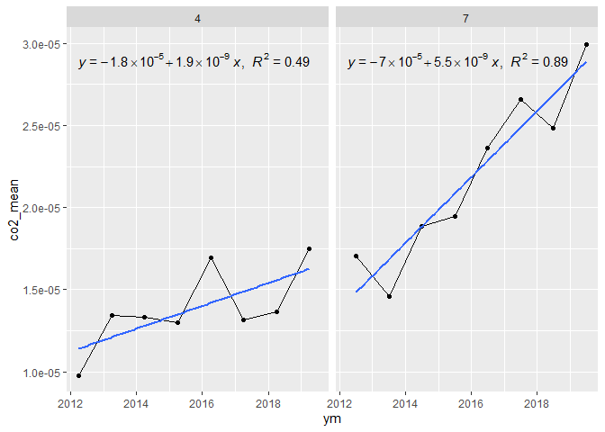

<!-- README.md is generated from README.Rmd. Please edit that file -->

# luciano-maria-dr

## Organizandos os dados, compilando, selecionando e criando datas

``` r
`%>%` <- magrittr::`%>%`

amazon_data <- rbind(readr::read_rds("data/df_1.rds"),
readr::read_rds("data/df_2.rds"),
readr::read_rds("data/df_3.rds")) %>%
  janitor::clean_names() %>%
  dplyr::mutate(year = as.numeric(substr(ymd, 1, 4)),
         month = as.numeric(substr(ymd, 5, 6)),
         day = as.numeric(substr(ymd, 7, 8)),
         date = lubridate::make_date(year,month,day)) %>%
  dplyr::select(-ymd, -flag_am) %>%
  dplyr::relocate(long,lat,date,year,month,day)
dplyr::glimpse(amazon_data)
#> Rows: 3,318,517
#> Columns: 10
#> $ long     <dbl> -64.4425, -60.5525, -60.5375, -60.5275, -60.5325, -60.7125, -~
#> $ lat      <dbl> 3.8575, 4.9125, 4.8325, 4.8275, 4.8225, 4.7325, 4.7125, 4.437~
#> $ date     <date> 2012-01-20, 2012-01-20, 2012-01-20, 2012-01-20, 2012-01-20, ~
#> $ year     <dbl> 2012, 2012, 2012, 2012, 2012, 2012, 2012, 2012, 2012, 2012, 2~
#> $ month    <dbl> 1, 1, 1, 1, 1, 1, 1, 1, 1, 1, 1, 1, 1, 1, 1, 1, 1, 1, 1, 1, 1~
#> $ day      <dbl> 20, 20, 20, 20, 20, 20, 20, 20, 20, 20, 20, 20, 20, 20, 20, 2~
#> $ ch4      <dbl> 1.074019e-07, 1.255490e-08, 7.695770e-09, 9.797025e-09, 9.360~
#> $ co       <dbl> 1.718430e-06, 3.208474e-07, 1.966697e-07, 2.503684e-07, 2.392~
#> $ co2      <dbl> 2.676785e-05, 7.718937e-06, 4.731473e-06, 6.023356e-06, 5.754~
#> $ frp_mean <dbl> 6.6500, 2.3000, 1.4100, 1.7950, 1.7150, 3.6200, 1.8350, 0.980~
```

## Mapas para teste

``` r
amazon_data %>% 
  dplyr::group_by(year,month) %>% 
  dplyr::summarise(co2_mean = mean(co2,na.rm=TRUE),
                   n=dplyr::n(),
                   co2_stderr = sd(co2,na.rm=TRUE)/(n)^.5) %>% 
  dplyr::mutate(ym = lubridate::make_date(year,month,day=1)
                ) %>% 
  ggplot2::ggplot(ggplot2::aes(ym,co2_mean)) +
  ggplot2::geom_point() +
  ggplot2::geom_line()
```

<!-- -->

## Espacializando

``` r
amazon_data %>%
  dplyr::filter(month == 4) %>% 
  dplyr::group_by(year, long,lat) %>% 
  dplyr::summarise(co2_mean = mean(co2,na.rm=TRUE),
                   n=dplyr::n(),
                   co2_stderr = sd(co2,na.rm=TRUE)/(n)^.5) %>% 
  ggplot2::ggplot(ggplot2::aes(long,lat,color=co2_mean)) +
  ggplot2::geom_point() +
  ggplot2::facet_wrap(~year)
```

<!-- -->
